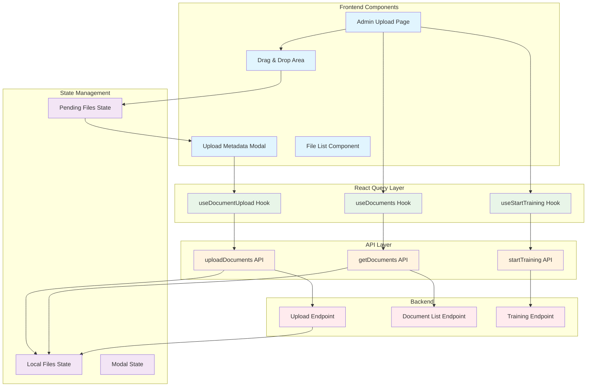
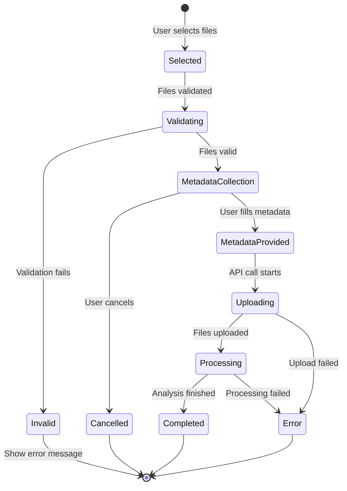
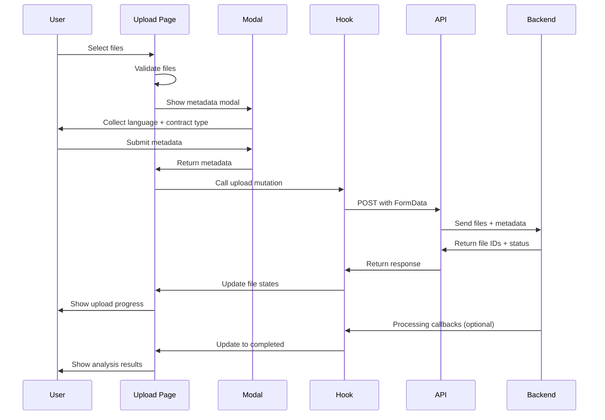
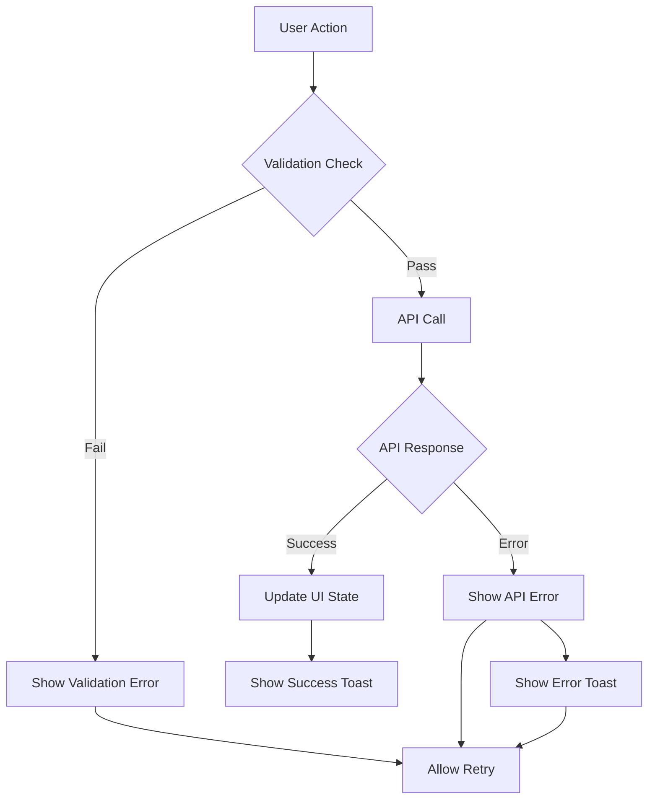

# Document Upload Flow Diagram

## Complete Data Flow Visualization



## File States Lifecycle



## Component Interaction Timeline



## Data Structures

### Local State (UploadedFile)
```typescript
{
  id: "temp_12345",           // Temporary until API response
  file: File,                 // Browser File object
  status: "uploading",        // Current processing state
  progress: 0,               // Upload percentage
  metadata: {                // User-provided data
    language: "english",
    contractType: "EMPLOYMENT_CONTRACT"
  },
  analysis: {                // AI analysis results
    type: "Employment Agreement",
    confidence: 94,
    keyPoints: ["Salary", "Terms", "Benefits"]
  }
}
```

### API Request Format
```typescript
FormData {
  language: "english",
  contract_type: "EMPLOYMENT_CONTRACT",
  files: [
    File("contract1.pdf"),
    File("contract2.docx"),
    File("contract3.pdf")
  ]
}
```

### API Response Format
```typescript
{
  success: true,
  message: "Files uploaded successfully",
  data: {
    uploaded_files: [
      {
        id: "api_file_id_1",
        filename: "contract1.pdf",
        size: 1048576,
        status: "completed",
        analysis: {
          type: "Employment Agreement",
          confidence: 94,
          keyPoints: ["Salary", "Terms", "Benefits"]
        }
      }
    ]
  },
  errors: []
}
```

## Error Handling Flow



## Key Features Explained

### 1. Multi-File Upload
- **Drag & Drop**: Users can drag multiple files at once
- **File Selection**: Click to browse and select multiple files
- **Batch Processing**: All files processed together with same metadata

### 2. Metadata Collection
- **Language Selection**: Choose between English and Arabic
- **Contract Types**: Predefined dropdown with legal document types
- **Validation**: Ensures all required metadata is provided

### 3. Progress Tracking
- **Real-time Updates**: Shows upload progress for each file
- **Status Indicators**: Clear visual feedback for each file's state
- **Error Handling**: Specific error messages for different failure types

### 4. State Management
- **Optimistic Updates**: Immediate UI feedback before API confirmation
- **Cache Management**: Automatic refresh of document lists
- **Persistent State**: Maintains file state throughout the session

### 5. Security
- **Authentication**: All requests include Bearer token
- **Role-based Access**: Admin-only functionality
- **File Validation**: Client and server-side file type validation
