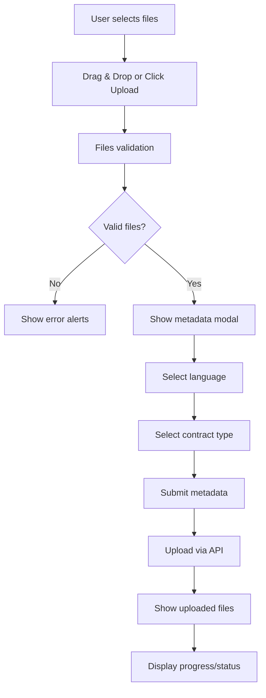

# Document Upload System Documentation

## Overview

The Document Upload System is a comprehensive file upload and management system designed for admin users to upload legal documents for AI model training. It supports multiple file types, metadata collection, and real-time progress tracking.

## System Architecture

```
┌─────────────────┐    ┌─────────────────┐    ┌─────────────────┐
│   Frontend UI   │ →  │   React Hooks   │ →  │   API Layer     │
│                 │    │                 │    │                 │
│ Upload Modal    │    │ useDocumentUpload│    │ authApi         │
│ Progress Bars   │    │ useDocuments    │    │ FormData        │
│ File Lists      │    │ useStartTraining│    │ Bearer Token    │
└─────────────────┘    └─────────────────┘    └─────────────────┘
         ↓                        ↓                        ↓
┌─────────────────┐    ┌─────────────────┐    ┌─────────────────┐
│   State Mgmt    │    │   Query Cache   │    │   Backend API   │
│                 │    │                 │    │                 │
│ File Arrays     │    │ React Query     │    │ Upload Endpoint │
│ Progress States │    │ Cache Invalidation│    │ Training Endpoint│
│ Modal States    │    │ Toast Notifications│    │ Document Listing│
└─────────────────┘    └─────────────────┘    └─────────────────┘
```

## File Structure

### Core Components

1. **`app/dashboard/admin/upload/page.tsx`** - Main upload interface
2. **`components/admin/upload-metadata-modal.tsx`** - Metadata collection modal
3. **`hooks/useDocumentUpload.ts`** - React Query hooks for API operations
4. **`lib/api/auth.ts`** - API function definitions

### Component Hierarchy

```
AdminUploadPage
├── UploadMetadataModal
│   ├── File List Display 
│   ├── Language Selection (English/Arabic)
│   └── Contract Type Dropdown
├── Upload Area (Drag & Drop)
├── Previously Uploaded Documents (API)
├── Current Session Files (Local State)
└── Training Tips & Actions
```

## Detailed Component Breakdown

### 1. Main Upload Page (`admin/upload/page.tsx`)

#### State Management

```typescript
interface UploadedFile {
  id: string;                              // Unique identifier
  file: File;                             // Actual file object
  status: "uploading" | "completed" | "error" | "processing";
  progress: number;                       // 0-100 percentage
  metadata?: {                            // User-provided data
    language: "english" | "arabic";
    contractType: string;
  };
  analysis?: {                            // AI analysis results
    type: string;
    confidence: number;
    keyPoints: string[];
  };
}
```

#### Key Functions

##### `processFilesWithMetadata(metadata)`
```typescript
// Adds files to local state → Calls API → Updates state with response
1. Create local file objects with "uploading" status
2. Update local state immediately (optimistic UI)
3. Call uploadMutation.mutate() with files + metadata
4. On success: Update local files with API response
5. On error: Set files to "error" status
```

##### `addFiles(files)`
```typescript
// Validates files before modal collection
1. Check file count limit (max 10)
2. Check file size limit (max 2MB each)
3. Check file type support (PDF, DOCX, DOC, CSV, Images)
4. Filter valid files
5. Set pendingFiles state → Show metadata modal
```

##### `handleDrag` and `handleDrop`
```typescript
// Handles drag & drop functionality
1. Prevent default browser behavior
2. Add visual feedback (border highlight)
3. Process dropped files through addFiles()
```

#### File Validation Rules

| Property | Value | Error Message |
|----------|-------|---------------|
| Max Files | 10 files | "Maximum 10 files can be uploaded at once" |
| Max Size | 2MB per file | "File [name] size too large (max 2MB)" |
| Supported Types | PDF, DOCX, DOC, CSV, JPEG, PNG, GIF, WEBP | "File type [name] not supported" |

### 2. Upload Metadata Modal (`upload-matadata-modal.tsx`)

#### Purpose
Collects essential metadata before file upload:
- **Language**: English 🇬🇧 or Arabic 🇸🇦 
- **Contract Type**: Select from predefined options

#### Contract Types Enum
```typescript
const CONTRACT_TYPES = {
  EMPLOYMENT_CONTRACT: "Employment Contract",
  PARTNERSHIP_CONTRACT: "Partnership Contract", 
  SERVICE_CONTRACT: "Service Contract",
  LEASE_CONTRACT: "Lease Contract",
  SALES_CONTRACT: "Sales Contract",
  LABOR_LAW: "Labor Law",
  COMMERCIAL_LAW: "Commercial Law",
  CIVIL_LAW: "Civil Law",
  OTHER: "Other"
}
```

#### Modal Flow
```typescript
1. Show file list with names and sizes
2. Display language radio buttons (English/Arabic)
3. Display contract type dropdown with all options
4. Validate required fields
5. Submit metadata back to parent component
6. Close modal and trigger file upload
```

### 3. React Query Hooks (`useDocumentUpload.ts`)

#### `useDocumentUpload()`
```typescript
// Handles file upload with FormData
mutationFn: (data: UploadDocumentData) => authApi.uploadDocuments(data)

onSuccess: 
- Show toast notification
- Invalidate documents cache (refresh list)
- Trigger automatic refetch

onError:
- Show error toast
- Log error details
```

#### `useDocuments()`
```typescript
// Queries uploaded documents from API
queryKey: ["documents"]
queryFn: () => authApi.getDocuments()

select: (response) => {
  // Transform API response to local format
  return response.success ? response.data.documents : []
}
```

#### `useStartTraining()`
```typescript
// Initiates model training with uploaded documents
mutationFn: () => authApi.startTraining()

onSuccess:
- Show success toast
- Refresh documents list (status updates)

onError:
- Show error toast
- Log error details
```

### 4. API Layer (`lib/api/auth.ts`)

#### `uploadDocuments(data)`
```typescript
// Creates FormData for multipart upload
const formData = new FormData();
formData.append('language', data.language);
formData.append('contract_type', data.contractType);

// Append each file
data.files.forEach((file) => {
  formData.append('files', file);
});

// Send POST request with Bearer token
return apiCall("/legal-assistant/documents/upload", {
  method: "POST",
  headers: {
    "Authorization": `Bearer ${token}`,
    // No Content-Type header for FormData (auto-boundary)
  },
  body: formData,
});
```

#### `getDocuments()`
```typescript
// Fetches list of uploaded documents
return apiCall("/admin/documents", {
  method: "GET",
  headers: {
    "Authorization": `Bearer ${token}`,
  },
});
```

#### `startTraining()`
```typescript
// Initiates model training process
return apiCall("/admin/training/start", {
  method: "POST",
  headers: {
    "Authorization": `Bearer ${token}`,
  },
});
```

## User Workflow

### Upload Process


### File States Throughout Process

1. **Selected** → Files chosen but metadata not collected
2. **Uploading** → Files being sent to server (with progress bar)
3. **Processing** → Server analyzing files
4. **Completed** → Analysis complete with results displayed
5. **Error** → Upload or processing failed

## API Integration Points

### Expected Backend Endpoints

#### POST `/legal-assistant/documents/upload`
**Request:**
```typescript
FormData {
  language: "english" | "arabic"
  contract_type: "EMPLOYMENT_CONTRACT"
  files: File[] // Multiple files
}
```

**Response:**
```typescript
{
  success: boolean
  message: string
  data?: {
    uploaded_files: Array<{
      id: string
      filename: string
      size: number
      status: "uploading" | "processing" | "completed" | "error"
      analysis?: {
        type: string
        confidence: number
        keyPoints: string[]
      }
    }>
  }
  errors?: Record<string, string>
}
```

#### GET `/legal-assistant/documents`
**Response:**
```typescript
{
  success: boolean
  message: string
  data?: {
    documents: Array<{
      id: string
      filename: string
      size: number
      upload_date: string
      status: "uploading" | "processing" | "completed" | "error"
      language: "english" | "arabic"
      contract_type: string
      analysis?: {
        type: string
        confidence: number
        keyPoints: string[]
      }
    }>
    total: number           // Total number of documents
    page: number           // Current page number
    page_size: number      // Number of items per page
  }
  errors: Array<any>      // Any error messages
}
```

**Example Response (Empty State):**
```typescript
{
  "success": true,
  "message": "Retrieved 0 documents",
  "data": {
    "documents": [],
    "total": 0,
    "page": 1,
    "page_size": 20
  },
  "errors": []
}
```

**What This Empty Response Means:**
- ✓ **API is working correctly** - Authentication successful
- ✓ **No documents uploaded yet** - Clean slate for new uploads
- ✓ **Pagination ready** - System supports 20 docs per page
- ✓ **Ready for upload** - User can start adding documents immediately
- ✓ **Training disabled** - Start Training button unavailable until documents exist

#### POST `/admin/training/start`
**Response:**
```typescript
{
  success: boolean
  message: string
  data?: {
    training_session_id: string
    status: "started" | "in_progress" | "completed" | "error"
    estimated_completion?: string
  }
}
```

## Error Handling

### Client-Side Validation
- **File count**: Prevents uploading more than 10 files
- **File size**: Blocks files larger than 2MB
- **File type**: Only allows supported formats
- **Required fields**: Ensures metadata is provided

### API Error Handling
- **Network errors**: Displayed via toast notifications
- **Validation errors**: Show specific field errors
- **Server errors**: Generic error messages with logging
- **Authentication errors**: Redirect or show access denied

### UI Error States
- **Loading states**: Spinners and progress indicators
- **Error boundaries**: Graceful failure handling
- **Retry mechanisms**: Allow users to retry failed uploads
- **Status indicators**: Clear visual feedback for all states

## Performance Considerations

### File Processing
- **Chunked uploads**: Large files handled efficiently
- **Progress tracking**: Real-time upload feedback
- **Memory management**: Files processed without loading entirely into memory

### State Management
- **Optimistic updates**: Immediate UI feedback
- **Cache invalidation**: Automatic refresh after operations
- **Debounced actions**: Prevent duplicate API calls

### User Experience
- **Drag & drop**: Intuitive file selection
- **Visual feedback**: Clear status indicators
- **Error recovery**: Ability to retry failed operations
- **Bulk operations**: Multiple file handling

## Security Features

### Authentication
- **Bearer token**: All requests authenticated
- **Role-based access**: Admin-only upload functionality
- **Token refresh**: Automatic token renewal

### File Security
- **Type validation**: Prevents malicious file uploads
- **Size limits**: Prevents DoS attacks
- **Server validation**: Additional backend security

### Data Protection
- **Secure upload**: HTTPS-only transmission
- **Storage security**: Server-side file management
- **Access control**: Admin-only document management

## Implementation Notes

### Dependencies
- **React Query**: Data fetching and caching
- **React Hot Toast**: User notifications
- **Lucide React**: Icon library
- **Tailwind CSS**: Styling framework

### Browser Support
- **File API**: Modern browsers required
- **FormData**: IE 10+ support
- **Drag & Drop**: All modern browsers
- **Progress Events**: Real-time upload feedback

This system provides a comprehensive solution for document management and AI model training preparation, with robust error handling, security features, and an intuitive user interface.
